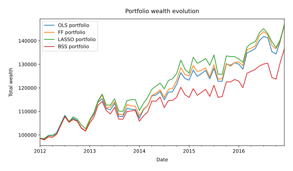
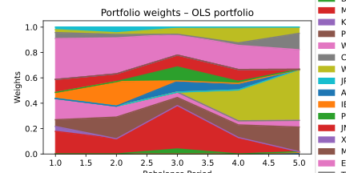
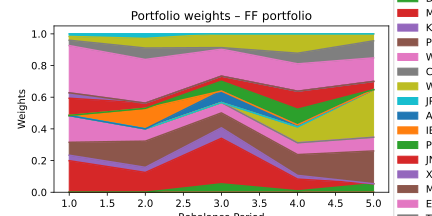
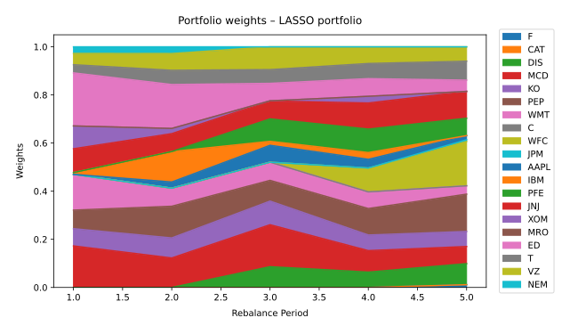
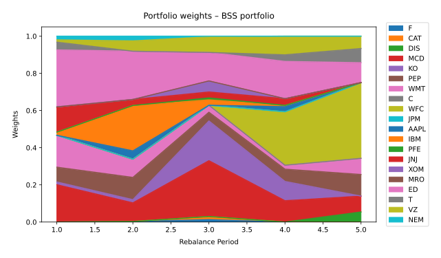

# 1. Introduction

In this project, we study how different factor models can be used to estimate the inputs required for portfolio optimization. More specifically, we compare four models: an Ordinary Least Squares (OLS) model using all eight factors, the Fama-French three-factor model (FF), a Least Absolute Shrinkage and Selection Operator model (LASSO), and a Best Subset Selection model (BSS).

The main idea behind factor models is that asset returns can be explained by their exposure to common sources of systematic risk. Instead of treating each stock in isolation, we attribute each stock's returns to shared risk factors such as the market, size, value, profitability, investment, momentum, and reversal effects. Measuring these exposures — known as factor loadings — allows us to estimate expected returns and the covariance structure of assets in a structured and parsimonious way.

Our investment universe is composed of 20 U.S. stocks. We use monthly adjusted closing prices to compute asset returns and monthly factor returns from the Ken French Data Library to estimate the factor models. Since the project focuses on excess returns, we subtract the monthly risk-free rate from the asset returns before estimating the models.

Once the expected return vector $\mu$ and covariance matrix $Q$ are estimated, we use them as inputs in a Mean-Variance Optimization (MVO) framework. The objective is to minimize portfolio variance while achieving a target expected return, subject to the constraint that short selling is not allowed.

The portfolios are tested over a five-year out-of-sample period from 2012 to 2016. At the beginning of each year, we recalibrate the models using the previous four years of data and rebalance the portfolio accordingly. This rolling-window procedure allows us to evaluate and compare the investment performance of the four factor models in a realistic setting.

The goal of this report is to compare the models both statistically and financially. For the in-sample analysis, we use the adjusted $R^2$ to evaluate how well each model explains historical excess returns after penalizing for model complexity. For the out-of-sample analysis, we compare portfolio return, volatility, Sharpe ratio, wealth evolution, and portfolio composition across all four models.

# 2. Data

## 2.1 Asset Price Data

The investment universe consists of 20 U.S. stocks whose tickers are listed in Table 1. The dataset provides monthly adjusted closing prices for each stock from December 2005 to December 2016. These prices are used to compute monthly asset returns.

**Table 1: Investment Universe**

| F | CAT | DIS | MCD | KO | PEP | WMT | C | WFC | JPM |
|---|-----|-----|-----|----|-----|-----|---|-----|-----|
| AAPL | IBM | PFE | JNJ | XOM | MRO | ED | T | VZ | NEM |

Adjusted closing prices are used instead of regular closing prices because they account for corporate actions such as dividends, stock splits, and rights offerings. In a backtest, failing to account for these events would distort the measured return series — for example, a stock split would appear as a large price drop that never actually reduced investor wealth. Using adjusted prices therefore gives a more accurate reflection of the total return earned by an investor holding the stock through these events.

The monthly return for each asset is computed as:

$$
r_{i,t} = \frac{P_{i,t}}{P_{i,t-1}} - 1
$$

where $P_{i,t}$ is the adjusted closing price of asset $i$ at the end of month $t$.

## 2.2 Factor Return Data

The project also provides monthly returns for eight risk factors drawn from the Ken French Data Library. These factors are used to explain the systematic component of asset returns. The eight factors are listed in Table 2.

**Table 2: Risk Factors**

| Factor | Name | Economic Interpretation |
|--------|------|------------------------|
| Mkt-RF | Market excess return | Broad market risk premium |
| SMB | Size | Return spread between small and large firms |
| HML | Value | Return spread between value and growth firms |
| RMW | Profitability | Return spread between profitable and unprofitable firms |
| CMA | Investment | Return spread between low and high investment firms |
| Mom | Momentum | Return spread based on prior 12-month performance |
| ST Rev | Short-term reversal | Return spread based on prior 1-month performance |
| LT Rev | Long-term reversal | Return spread based on prior 5-year performance |

All eight factors are derived from synthetic long-short portfolios of stocks with shared characteristics. Because they are constructed from overlapping universes of assets, the factors exhibit non-trivial pairwise correlations. This means our factor models do not operate in the ideal orthogonal-factor environment, and the off-diagonal elements of the factor covariance matrix $\Sigma_f$ are non-zero. These covariance terms must therefore be included when computing the asset covariance matrix $Q$.

## 2.3 Excess Return Computation

Since the factor models are estimated using excess returns, the monthly risk-free rate $r_{f,t}$ is subtracted from each asset return. The excess return is defined as:

$$
r_{i,t}^{e} = r_{i,t} - r_{f,t}
$$

where $r_{i,t}$ is the monthly return of asset $i$ and $r_{f,t}$ is the monthly risk-free rate provided alongside the factor data. The excess returns form the dependent variable in each factor model, allowing us to focus on the compensation earned above the risk-free rate.

## 2.4 Calibration and Testing Windows

The portfolios are evaluated over a five-year out-of-sample period from 2012 to 2016. Before each investment year, the factor models are calibrated using the previous four years of monthly data. Table 3 summarizes the five rolling windows used in the experiment.

**Table 3: Rolling Calibration and Test Windows**

| Period | Calibration Window | Investment Year |
|--------|--------------------|-----------------|
| 1 | Jan 2008 – Dec 2011 | 2012 |
| 2 | Jan 2009 – Dec 2012 | 2013 |
| 3 | Jan 2010 – Dec 2013 | 2014 |
| 4 | Jan 2011 – Dec 2014 | 2015 |
| 5 | Jan 2012 – Dec 2015 | 2016 |

Each calibration window contains exactly 48 monthly observations. At the end of each investment year, the model is recalibrated using the most recent four-year window and the portfolio is rebalanced. This rolling-window approach allows us to evaluate model performance in a realistic out-of-sample setting while avoiding look-ahead bias.

# 3. Methodology

## 3.1 Overview of Factor Models

Factor models are linear regression models used to explain asset excess returns as a linear combination of common risk factors. For each asset $i$, the general form of the model is:

$$
r_i^e = \alpha_i + \sum_{k=1}^{K} \beta_{ik} f_k + \varepsilon_i
$$

where $r_i^e = r_i - r_f$ is the asset excess return, $\alpha_i$ is the intercept capturing return not explained by the factors, $f_k$ is the return of factor $k$, $\beta_{ik}$ is the factor loading of asset $i$ on factor $k$, and $\varepsilon_i \sim (0, \sigma_i^2)$ is the idiosyncratic error term, assumed uncorrelated across assets.

The four models considered in this project differ in how they select and estimate the factor loadings. Once estimated, all four models use the same formulas to compute $\mu$ and $Q$.

**Expected return vector.** For each asset $i$, the expected excess return is:

$$
\mu_i = \alpha_i + \boldsymbol{\beta}_i^\top \mathbb{E}[\mathbf{f}]
$$

where $\boldsymbol{\beta}_i = (\beta_{i1}, \dots, \beta_{iK})^\top$ is the vector of factor loadings and $\mathbb{E}[\mathbf{f}]$ is estimated by the sample mean of the factor returns over the calibration window.

**Covariance matrix.** The asset covariance matrix decomposes into a systematic component driven by shared factor exposure and an idiosyncratic component:

$$
Q = B^\top \Sigma_f B + D
$$

where $B$ is the $p \times n$ matrix of factor loadings, $\Sigma_f$ is the $p \times p$ factor covariance matrix estimated from the calibration window, and $D = \text{diag}(\sigma_1^2, \dots, \sigma_n^2)$ is the diagonal matrix of residual variances. The off-diagonal elements of $D$ are set to zero, reflecting the assumption that idiosyncratic risks are uncorrelated across assets. The factor covariance matrix $\Sigma_f$ is not restricted to be diagonal, so the full correlation structure among factors is preserved.

## 3.2 OLS Model

The Ordinary Least Squares model regresses each asset's excess return on all eight factors simultaneously. For asset $i$:

$$
r_i^e = \alpha_i + \beta_{i1}f_1 + \beta_{i2}f_2 + \cdots + \beta_{i8}f_8 + \varepsilon_i
$$

Writing this in matrix form across all $T$ observations and all $n$ assets simultaneously, we have:

$$
Y = XB + E
$$

where $Y \in \mathbb{R}^{T \times n}$ is the matrix of excess returns, $X \in \mathbb{R}^{T \times 9}$ is the design matrix with a column of ones prepended for the intercept, $B \in \mathbb{R}^{9 \times n}$ is the coefficient matrix, and $E \in \mathbb{R}^{T \times n}$ is the matrix of residuals. The OLS estimator minimizes the sum of squared residuals and has the closed-form solution:

$$
\hat{B} = (X^\top X)^{-1}X^\top Y
$$

In practice this is computed via the numerically stable least-squares solver rather than direct matrix inversion, which can be ill-conditioned when columns of $X$ are correlated.

The OLS model uses all available factor information, making it the most flexible of the four models. However, because it includes all eight factors without restriction, it is the most exposed to overfitting — particularly when factors are correlated and the calibration window is limited to 48 observations.

## 3.3 Fama-French Three-Factor Model

The Fama-French model is a restricted version of the OLS model that uses only three theoretically motivated factors: the market excess return, the size factor (SMB), and the value factor (HML). The model for each asset $i$ is:

$$
r_i^e = \alpha_i + \beta_{im}(r_m - r_f) + \beta_{is}\text{SMB} + \beta_{iv}\text{HML} + \varepsilon_i
$$

where $\beta_{im}$, $\beta_{is}$, and $\beta_{iv}$ are the factor loadings on the market, size, and value factors respectively. The coefficients are estimated by OLS using only the three selected factor columns:

$$
\hat{B}_{FF} = (X_{FF}^\top X_{FF})^{-1} X_{FF}^\top Y
$$

where $X_{FF} \in \mathbb{R}^{T \times 4}$ contains the intercept and the three Fama-French factor returns.

The model is grounded in the empirical asset pricing literature. Fama and French (1993) showed that the three-factor model explains a large fraction of cross-sectional return variation that the CAPM cannot capture. By restricting the model to these three factors, we impose economic structure rather than letting the data determine factor inclusion. This reduces the risk of overfitting and produces more stable coefficient estimates, at the cost of potentially missing return variation captured by the excluded factors such as momentum and profitability.

## 3.4 LASSO Model

The LASSO model performs simultaneous estimation and factor selection through a penalized regression framework. For each asset $i$ independently, the LASSO solves:

$$
\min_{\mathbf{B}_i} \left\| \mathbf{r}_i^e - X\mathbf{B}_i \right\|_2^2 + \lambda \left\| \mathbf{B}_i \right\|_1
$$

where $\mathbf{B}_i \in \mathbb{R}^{p+1}$ stacks the intercept $\alpha_i$ and all $p = 8$ factor loadings, and $\lambda \geq 0$ is the penalty parameter. The $L_1$ norm penalty has a well-known geometric property: because the $L_1$ ball has corners at the coordinate axes, the optimal solution tends to set some coefficients exactly to zero. This produces a sparse model where only a subset of factors are selected per asset.

The penalty is applied to the full coefficient vector including the intercept, which allows the LASSO to determine whether the intercept should be included at all. Unlike the FF model, which imposes the same three factors on all assets, the LASSO selects a potentially different subset of factors for each asset based on its individual return history.

**Selection of $\lambda$.** The penalty parameter $\lambda$ controls the sparsity-accuracy trade-off. A larger $\lambda$ drives more coefficients to zero, producing a sparser but potentially less accurate model. We select $\lambda$ by evaluating a grid of candidate values on the first calibration window (2008–2011) and choosing the value that produces an average of two to five non-zero coefficients per asset across the 20 stocks. This range ensures that the selected model is sparse enough to mitigate overfitting while retaining enough factor exposure to produce meaningful return and risk estimates. The selected value of $\lambda$ is then held fixed across all five investment periods to avoid look-ahead bias.

| Lambda | Average Non-Zero Coefficients Per Asset |
|--------|-----------------------------------------|
| 0.001 | 8.60 |
| 0.005 | 7.35 |
| 0.010 | 6.30 |
| 0.020 | 4.80 |
| 0.050 | 3.05 |
| 0.100 | 2.15 |

Each LASSO subproblem is solved as a convex optimization problem using the CVXPY modelling framework with the CLARABEL solver.

## 3.5 Best Subset Selection Model

The Best Subset Selection model achieves sparsity through a direct combinatorial constraint rather than penalization. For each asset $i$, BSS solves:

$$
\min_{\mathbf{B}_i} \left\| \mathbf{r}_i^e - X\mathbf{B}_i \right\|_2^2 \quad \text{subject to} \quad \left\| \mathbf{B}_i \right\|_0 \leq K
$$

where $\|\mathbf{B}_i\|_0$ denotes the number of non-zero elements in $\mathbf{B}_i$ and $K$ is a user-specified maximum. In this project we set $K = 4$, meaning each asset's return is explained by at most four coefficients drawn from the intercept and eight factor loadings.

Because the number of candidate coefficients is small ($p + 1 = 9$), the BSS problem can be solved by exhaustive search. For each possible subset of size $k \leq K$ from $\{0, 1, \dots, 8\}$, we fit OLS using only the selected columns and record the residual sum of squares. The subset with the lowest SSE across all sizes and subsets is retained as the best model for that asset. This guarantees global optimality of the subset selection, unlike greedy forward or backward stepwise methods.

Unlike LASSO, which achieves sparsity indirectly through $L_1$ penalization, BSS directly solves the $L_0$-constrained problem. As shown by Bertsimas, King, and Mazumder (2016), this distinction matters in practice: LASSO is a convex relaxation of the $L_0$ problem and its solutions may differ from the true best subset, particularly when predictors are correlated. In this setting with only nine candidate coefficients, the exhaustive search is computationally feasible and provides the exact best-subset solution.

## 3.6 Adjusted $R^2$ as In-Sample Measure of Fit

To compare the in-sample fit of the four models in a fair way, we use the adjusted $R^2$, which penalizes models that use more parameters. The standard $R^2$ for asset $i$ is:

$$
R_i^2 = 1 - \frac{\sum_{t=1}^T \hat{\varepsilon}_{i,t}^2}{\sum_{t=1}^T (r_{i,t}^e - \bar{r}_i^e)^2}
$$

The adjusted $R^2$ modifies this by penalizing for the number of non-zero factor loadings $p_i$ used for asset $i$:

$$
\bar{R}_i^2 = 1 - (1 - R_i^2)\frac{T - 1}{T - p_i - 1}
$$

where $T$ is the number of observations in the calibration window (48 months). For OLS, $p_i = 8$ for all assets. For FF, $p_i = 3$. For LASSO and BSS, $p_i$ is determined by the number of non-zero factor loadings selected by the model, and may vary across assets.

By penalizing additional parameters, the adjusted $R^2$ allows a fair comparison between the parsimonious FF model (3 factors) and the full OLS model (8 factors). A model with a higher adjusted $R^2$ explains more return variation per parameter used.

## 3.7 Mean-Variance Optimization

Once $\mu$ and $Q$ are estimated from each factor model, they serve as inputs in a Mean-Variance Optimization problem. The objective is to find the portfolio weights $\mathbf{x}$ that minimize portfolio variance subject to achieving a target expected return $r_{\text{target}}$, with short selling disallowed:

$$
\min_{\mathbf{x}} \quad \mathbf{x}^\top Q \mathbf{x}
$$

$$
\text{subject to} \quad \boldsymbol{\mu}^\top \mathbf{x} \geq r_{\text{target}}
$$

$$
\sum_{i=1}^{n} x_i = 1
$$

$$
x_i \geq 0 \quad \forall\, i
$$

The constraint $\boldsymbol{\mu}^\top \mathbf{x} \geq r_{\text{target}}$ uses a weak inequality so that the optimizer is free to exceed the target if doing so reduces variance. In practice, this constraint binds at equality at the optimal solution. The constraint $\sum_i x_i = 1$ ensures the portfolio is fully invested, and $x_i \geq 0$ prohibits short positions.

The target return $r_{\text{target}}$ is set to the geometric mean of the market excess return over the current calibration period:

$$
r_{\text{target}} = \left(\prod_{t=1}^{T}(1 + f_{m,t})\right)^{1/T} - 1
$$

This target changes at each rebalancing date as the calibration window rolls forward. If the target return is infeasible — that is, it exceeds the maximum achievable expected return given $\mu$ — the return constraint is dropped and the minimum-variance portfolio is returned instead.

The MVO problem is solved using CVXPY with the CLARABEL solver, which handles the quadratic objective and linear constraints reliably across all five rebalancing periods.

## 3.8 Rebalancing Procedure

The investment horizon runs from January 2012 to December 2016, with annual rebalancing. At each rebalancing date, the following steps are performed:

1. Subset the previous four years of return and factor data as the calibration window.
2. Estimate $\mu$ and $Q$ from each of the four factor models.
3. Compute the target return as the geometric mean of the market factor over the calibration window.
4. Solve the MVO problem to obtain optimal portfolio weights $\mathbf{x}$.
5. Compute the number of shares to hold based on current portfolio value and asset prices.
6. Track portfolio value monthly throughout the investment year using realized prices.
7. Roll the calibration and test windows forward by one year and repeat.

This procedure is applied independently to each of the four factor models, producing four parallel portfolio wealth paths that can be compared over the out-of-sample period.

# 4. Results

## 4.1 In-Sample Analysis

The in-sample analysis evaluates how well each factor model explains historical asset excess returns during the calibration periods. The adjusted $R^2$ is averaged across all 20 assets for each model and each calibration window.

The regular $R^2$ measures the proportion of total return variation explained by the model. However, adding more factors mechanically increases $R^2$ even when the additional factors contribute no genuine explanatory power. The adjusted $R^2$ corrects for this by penalizing additional parameters, as described in Section 3.6. A model with higher adjusted $R^2$ is preferable in the sense that it explains more return variation per parameter used.

We expect OLS to achieve the highest raw $R^2$ since it minimizes in-sample SSE over all eight factors. However, the penalty in the adjusted $R^2$ may reduce its advantage over the more parsimonious models. LASSO and BSS select fewer factors and therefore incur a smaller penalty. If their factor subsets are well-chosen, they may achieve adjusted $R^2$ values competitive with or exceeding OLS. A table of average adjusted $R^2$ by model and calibration period is shown below:

| Period | OLS | FF | LASSO | BSS |
|--------|-----|----|-------|-----|
| 2008-2011 | 0.4797 | 0.4358 | 0.3998 | 0.4996 |
| 2009-2012 | 0.4767 | 0.3984 | 0.3373 | 0.4811 |
| 2010-2013 | 0.4364 | 0.3473 | 0.2603 | 0.4530 |
| 2011-2014 | 0.3974 | 0.2800 | 0.1854 | 0.4298 |
| 2012-2015 | 0.4393 | 0.3411 | 0.1982 | 0.4666 |
| Mean | 0.4459 | 0.3605 | 0.2762 | 0.4660 |

A few patterns worth noting when interpreting the table. First, OLS with eight factors has the largest penalty and will show the greatest gap between raw $R^2$ and adjusted $R^2$. Second, FF uses only three factors, so its penalty is modest; however, if the five excluded factors carry genuine explanatory power for the assets in our universe, FF will show meaningfully lower $R^2$. Third, LASSO and BSS penalize different assets differently since they select varying numbers of factors per asset — their average $p_i$ across assets is the relevant quantity for comparison.

## 4.2 Out-of-Sample Portfolio Performance

The out-of-sample analysis evaluates the financial performance of the four portfolios over the 2012–2016 investment horizon. For each model, we report the annualized average return, annualized volatility (standard deviation), and Sharpe ratio.

The annualized average return and volatility are computed from the monthly portfolio return series $\{r_t^p\}$ as:

$$
\bar{r}^p = 12 \times \frac{1}{T}\sum_{t=1}^T r_t^p, \qquad \sigma^p = \sqrt{12} \times \text{std}(r_t^p)
$$

The Sharpe ratio measures return per unit of risk and is defined as the excess return over the risk-free rate divided by volatility:

$$
\text{SR} = \frac{\bar{r}^p - \bar{r}_f}{\sigma^p}
$$

where $\bar{r}_f$ is the annualized average risk-free rate over the out-of-sample period. A higher Sharpe ratio indicates better risk-adjusted performance. Note that a portfolio with a lower absolute return can still achieve a higher Sharpe ratio if its volatility is sufficiently lower.

| Metric | OLS | FF | LASSO | BSS |
|--------|-----|----|-------|-----|
| Avg Annual Return | 0.0854 | 0.0855 | 0.0853 | 0.0704 |
| Annual Volatility | 0.0909 | 0.0911 | 0.0925 | 0.0915 |
| Sharpe Ratio | 0.9323 | 0.9324 | 0.9160 | 0.7626 |
| Total Return | 0.4895 | 0.4906 | 0.4881 | 0.3839 |

It is important to note that in-sample model fit does not necessarily translate into out-of-sample portfolio performance. MVO is well-known to be highly sensitive to the estimated inputs: small errors in $\mu$ tend to produce large swings in portfolio weights, and an overfit model that attributes noise to factor loadings will generate biased $\mu$ estimates. The comparison between in-sample adjusted $R^2$ and out-of-sample Sharpe ratio is therefore informative about whether statistical fit translates into economic value.

## 4.3 Portfolio Value Evolution

To visualize the out-of-sample performance, we plot the total wealth of each portfolio from January 2012 to December 2016, starting from an initial investment of $100,000.

The wealth plot allows us to identify periods where specific models outperform or underperform and to detect large drawdowns or periods of elevated volatility. Divergence between the four portfolios tends to be most pronounced following rebalancing dates, when the newly estimated $\mu$ and $Q$ lead to substantially different weight allocations across models.

## 4.4 Portfolio Composition

In addition to performance metrics, we analyze how the portfolio weights change at each annual rebalancing. Since short selling is not allowed, all weights are non-negative and sum to one. The area plots below show the weight allocated to each asset over the five investment periods.

A well-diversified portfolio allocates meaningful weight to many assets. A concentrated portfolio relies heavily on a small number of stocks, which can amplify idiosyncratic risk even if systematic risk is managed by the factor model. Because MVO tends to over-weight assets with high estimated $\mu$ and low estimated variance, the resulting portfolios are often more concentrated than a naive equal-weight portfolio. The degree of concentration varies across models depending on the spread and stability of the estimated expected returns.

# 5. Discussion

The results allow us to compare the four factor models from both a statistical and financial perspective. Rather than declaring one model universally superior, the discussion below highlights the trade-offs inherent in each approach and connects them to the empirical observations.

## 5.1 In-Sample Fit vs. Out-of-Sample Performance

A central theme of this project is the tension between in-sample model fit and out-of-sample portfolio performance. As expected, OLS achieves the highest raw $R^2$ by construction, since it minimizes in-sample SSE without any restriction. However, the adjusted $R^2$ penalizes the eight-factor model more heavily, and in practice, this penalty reduces or eliminates OLS's apparent advantage over the more parsimonious models.

More importantly, a high adjusted $R^2$ does not guarantee superior portfolio performance. MVO is known to be sensitive to estimation error, particularly in $\mu$. When a model overfits — that is, when it attributes random in-sample fluctuations to factor exposures — the resulting $\mu$ estimates are biased and the portfolio weights derived from them are suboptimal out-of-sample. This phenomenon, known as Markowitz's "error maximization" problem, explains why models with lower in-sample fit can sometimes generate better out-of-sample portfolios.

## 5.2 OLS

The OLS model provides a useful baseline. It imposes no restrictions on factor selection, so it captures all eight dimensions of systematic risk. However, with 48 monthly observations and eight factors, the design matrix is not particularly well-conditioned, especially given that several factors are correlated. This multicollinearity can produce unstable and inflated coefficient estimates, which in turn produce unreliable $\mu$ and $Q$ estimates. The resulting MVO portfolios may be poorly diversified, with large weights assigned to a small number of assets whose estimated returns happen to be highest in the calibration window but do not persist out-of-sample.

## 5.3 Fama-French

The FF model trades flexibility for stability. By restricting the model to three economically motivated factors, it avoids the multicollinearity issues of OLS and produces more stable coefficient estimates across calibration windows. The market, size, and value factors have decades of empirical support and are unlikely to be spurious. However, by excluding profitability, investment, momentum, and reversal factors, the FF model may systematically underestimate the expected return of assets with strong momentum or high profitability, leading to conservative $\mu$ estimates and a portfolio that is more risk-averse than necessary.

## 5.4 LASSO

The LASSO model offers a data-driven approach to factor selection. By penalizing the $L_1$ norm of the coefficients, it automatically identifies which factors are relevant for each individual asset without requiring the analyst to specify the model structure in advance. This is particularly valuable when the relevant factors differ across assets — for example, some stocks may be more sensitive to momentum while others are driven primarily by value exposure.

The main limitation of LASSO in this project is the need to select $\lambda$. Our approach of fixing $\lambda$ using the first calibration window and applying it uniformly across all five periods is methodologically clean but may not be optimal for later windows where the return-factor relationships have shifted. An adaptive $\lambda$ selected at each rebalancing date would be more responsive but risks introducing look-ahead bias if the selection criterion is not carefully defined.

## 5.5 Best Subset Selection

The BSS model takes the most direct approach to factor selection by finding the globally optimal subset of at most $K$ coefficients for each asset. With $K = 4$, each asset is described by a highly interpretable model. The exhaustive search guarantees that no other subset of size $\leq 4$ would yield lower in-sample SSE, which is a property that neither LASSO nor stepwise methods can claim.

However, BSS is more susceptible to in-sample overfitting than LASSO in a subtle way. While LASSO continuously shrinks coefficients toward zero through the $L_1$ penalty, providing a form of regularization even for selected factors, BSS applies no shrinkage to the selected coefficients — it simply fits OLS on the chosen subset. The selected subset can therefore attribute random in-sample variation to factor exposures just as OLS does, producing $\mu$ estimates that do not generalize well. This may help explain any relative underperformance of BSS observed in the wealth evolution plot.

The choice of $K$ also matters considerably. A value of $K = 4$ was used as the baseline, but testing $K = 3$ or $K = 5$ may reveal how sensitive the results are to this hyperparameter, analogous to the role that $\lambda$ plays in LASSO.

## 5.6 Sensitivity of MVO to Input Estimates

Across all four models, a recurring observation is that MVO amplifies differences in $\mu$ and $Q$ estimates into large differences in portfolio weights. Because the optimization actively seeks the minimum-variance portfolio subject to a return target, it will allocate heavily to any asset whose estimated $\mu$ is high relative to its estimated risk. When these estimates are noisy — as they inevitably are with 48 months of data — the resulting portfolios can be poorly diversified and fragile.

This sensitivity is a known limitation of unconstrained MVO and motivates extensions such as robust optimization, regularized covariance estimation (e.g. Ledoit-Wolf shrinkage), or direct weight constraints. Within the scope of this project, the factor model structure itself provides some implicit regularization through the decomposition $Q = B^\top \Sigma_f B + D$, which is more stable than the sample covariance matrix. Nevertheless, the quality of $\mu$ remains a fundamental bottleneck.

# 6. Conclusion

This project implemented and compared four factor models — OLS, Fama-French, LASSO, and Best Subset Selection — for estimating the expected return vector and covariance matrix used as inputs in Mean-Variance Optimization. The models were evaluated using both in-sample adjusted $R^2$ and out-of-sample portfolio metrics over a five-year investment horizon from 2012 to 2016.

The in-sample analysis confirmed that OLS achieves the highest raw explanatory power but incurs the largest penalty under adjusted $R^2$ due to its eight-factor structure. The FF model, despite its parsimony, captures a large share of return variation through its three well-grounded factors. The LASSO and BSS models produce sparse and interpretable factor structures that vary across assets, with adjusted $R^2$ values that reflect a genuine trade-off between fit and complexity.

The out-of-sample analysis revealed that in-sample statistical fit does not translate directly into portfolio performance. The interaction between factor model quality and MVO's sensitivity to estimation error determines the realized Sharpe ratio and wealth evolution. Models that appear overfit in-sample tend to generate volatile or concentrated portfolio weights that underperform once the calibration period ends. The FF model's theoretical grounding provides robustness that pure data-driven models may lack in short calibration windows.

More broadly, this project illustrates a fundamental principle in quantitative finance: the quality of a portfolio optimization outcome depends critically on the quality of the input estimates. A sophisticated optimization model applied to poor inputs will not produce a good portfolio. Conversely, a well-specified factor model that generates stable and economically meaningful estimates of $\mu$ and $Q$ can support robust portfolio construction even with a relatively simple MVO framework.

Future work could explore several extensions: applying Ledoit-Wolf shrinkage to stabilize the covariance estimates, using cross-validation to select $\lambda$ and $K$ at each rebalancing date, or incorporating additional constraints into MVO such as maximum weight limits to improve diversification and reduce sensitivity to estimation error.

# 7. References

[1] Quandl.com. *Wiki – Various End-Of-Day Stock Prices*. https://www.quandl.com/databases/WIKIP/usage/export. Accessed November 2017.

[2] French, K. R. *Data Library*. http://mba.tuck.dartmouth.edu/pages/faculty/ken.french/data_library.html. Accessed February 2020.

[3] Bertsimas, D., King, A., and Mazumder, R. "Best subset selection via a modern optimization lens." *The Annals of Statistics*, 2016, pp. 813–852.

[4] Fama, E. F. and French, K. R. "Common risk factors in the returns on stocks and bonds." *Journal of Financial Economics*, 33(1), 1993, pp. 3–56.

[5] Markowitz, H. "Portfolio selection." *The Journal of Finance*, 7(1), 1952, pp. 77–91.
